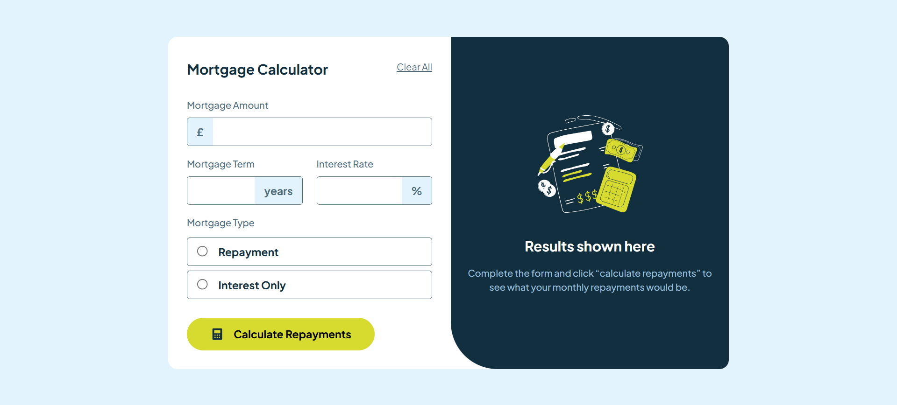
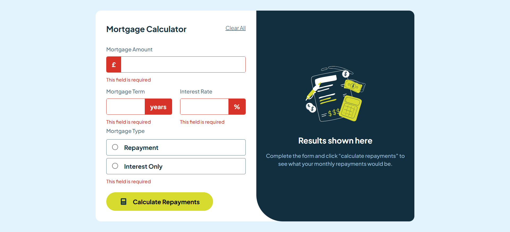

# Frontend Mentor - Browser extensions manager UI solution

This is a solution to the [Browser extensions manager UI challenge on Frontend Mentor](https://www.frontendmentor.io/challenges/browser-extension-manager-ui-yNZnOfsMAp). Frontend Mentor challenges help you improve your coding skills by building realistic projects.

## Overview

### The challenge

### Screenshot

***error shows***

### Links

- Solution URL: [solution URL here](https://github.com/molindu/Mortgage-Calculator.git)
- Live Site URL: [live site URL here](https://molindu.github.io/Mortgage-Calculator/)

## My process

### Built with

- Mobile-first workflow
- [React](https://reactjs.org/) - JS library

### Useful resources

- [React with Vite](https://vite.dev/guide/) - I started react with vite

## Author

- Website - [Molindu Yasoda](https://github.com/molindu/Mortgage-Calculator.git)

## Other project for references

- https://github.com/AbdElmalik100/Mortgage-Repayment-Calculator

